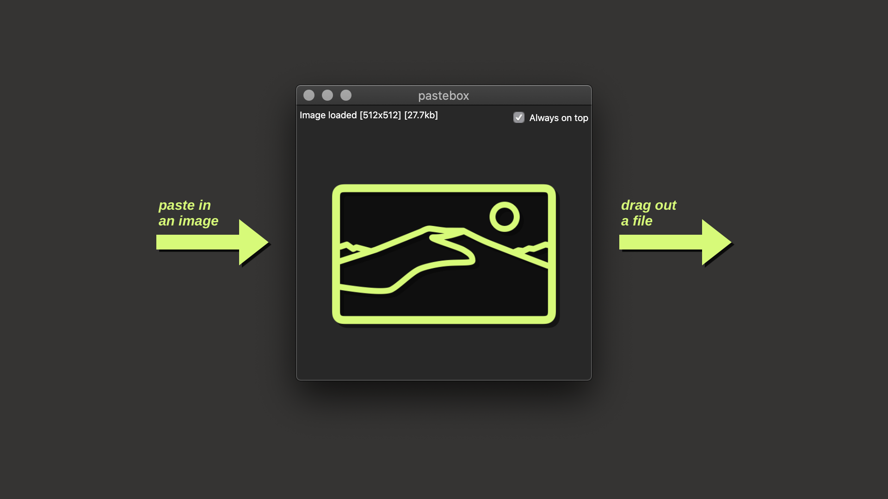

# pastebox

An Electron app for macOS that lets you paste image data from an application and drag it out as an image file to another application.

### &rarr; [Introduction post](https://dev.to/dtinth/pastebox-paste-in-an-image-drag-it-out-as-a-file-41m0)
### &rarr; [Introduction video](https://www.youtube.com/watch?v=E6aYLVxsRKA)

## Usage

1. Install npm first. 
2. `npm install -g yarn`
3. Clone the repository 
4. `cd pastebox`
5. `npm install`
6. `yarn`
7. `yarn build`
8. Open `dist/mac/pastebox.app`

